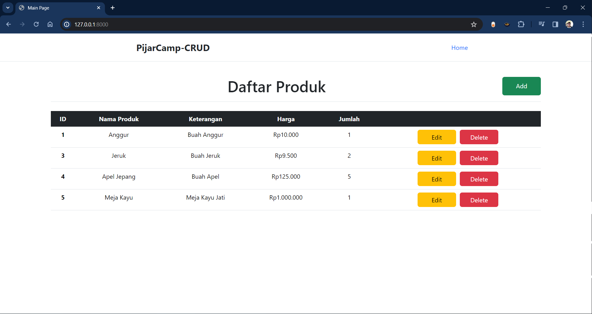
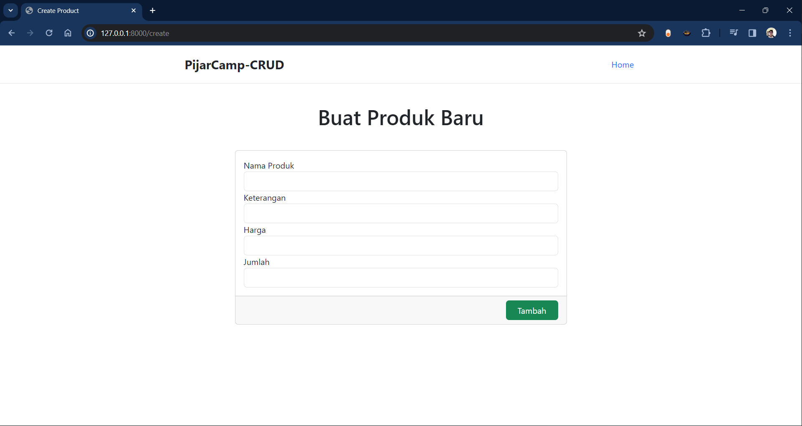
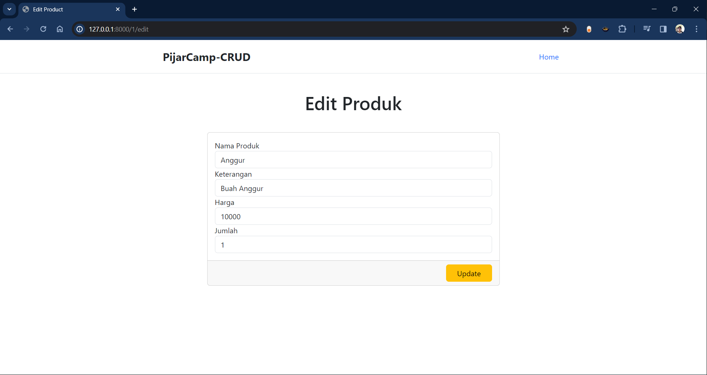

# **Aplikasi CRUD Sederhana Laravel**
**Halaman Depan**

**Halaman Create**

**Halaman Edit**

Aplikasi CRUD dengan Laravel

Petunjuk instalasi :

1. *Clone* repositori ini.
2. Jalankan perintah `composer install`.
3. Ubah *file* `.env` sesuai kebutuhan.
3. Jalankan perintah `php artisan migrate`.
4. Jalankan perintah `php artisan serve`.
